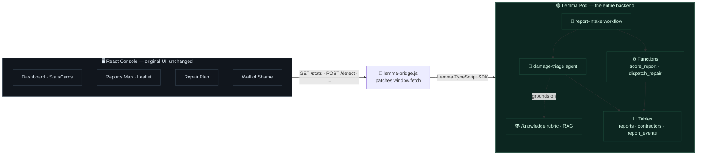
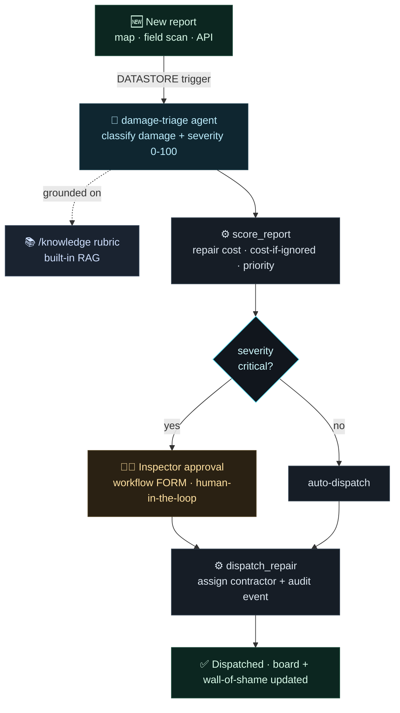
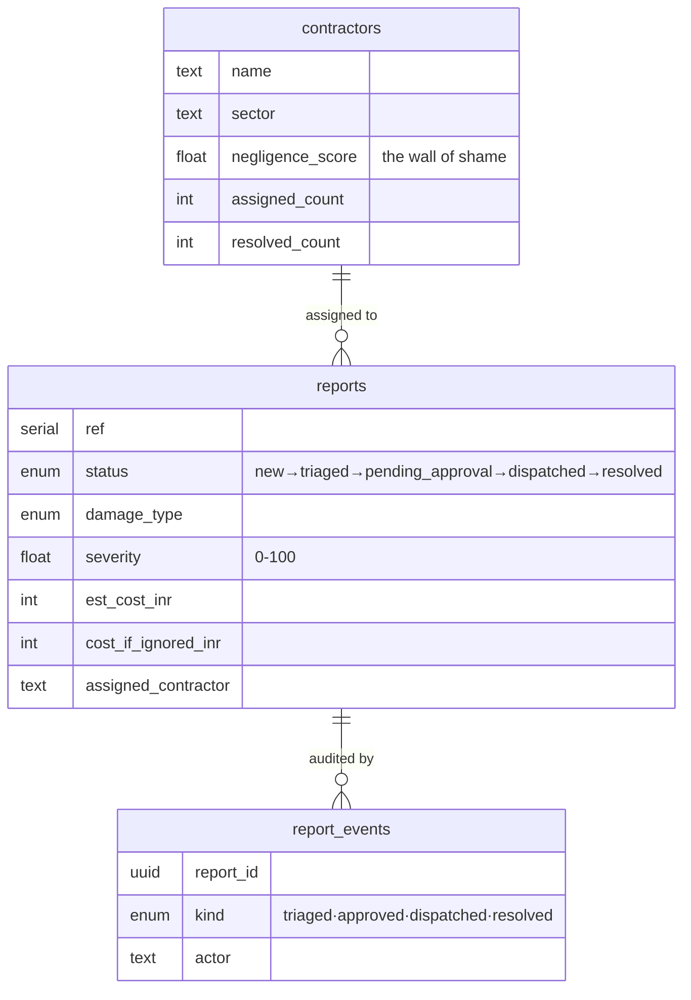
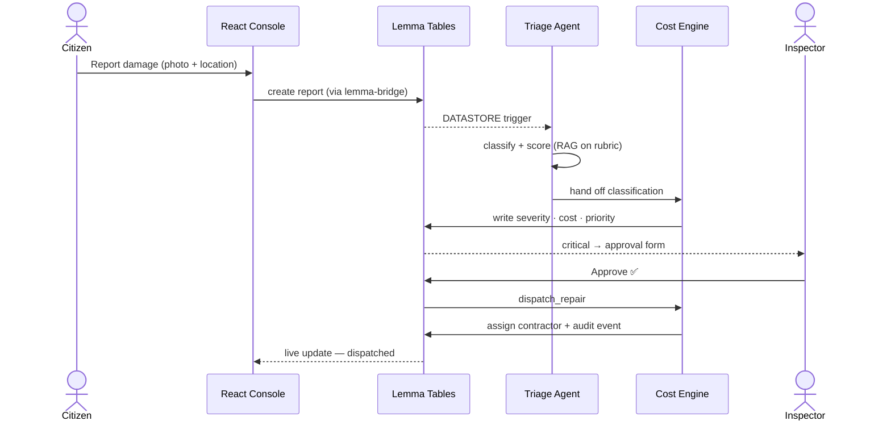

<h1 align="center">🛣️ CrackWatch <em>on</em> Lemma</h1>

<p align="center"><strong>An AI-native civic infrastructure command center — the entire backend rebuilt on the <a href="https://lemma.work">Lemma SDK</a>.</strong></p>

<p align="center">
  
  
  
  
  
</p>

---

Citizens report infrastructure damage — potholes, cracks, leaks. CrackWatch **triages each report with AI**, estimates the repair cost **and the cost of ignoring it**, routes critical cases to a **human inspector for approval**, **dispatches** the repair to an accountable contractor, and tracks every contractor's negligence on a public **wall of shame**.

The original CrackWatch ran a polished React UI on a FastAPI + in-memory backend with a YOLO CV model. **This version deletes that entire backend and replaces it with one Lemma pod.** The React UI is reused *unchanged*; a thin `fetch` bridge points it at the pod.

> 💡 **The point of Lemma:** keep your frontend — replace the database **+** agent runtime **+** workflow engine **+** RAG **+** auth **+** event triggers you'd otherwise stitch together with **one open-source pod** where humans and AI agents read and write the same state.

---

## 🏗️ Architecture

The frontend never changed. The backend became a pod.



Every component still calls `fetch('http://localhost:8000/...')`. [`console/src/lib/lemma-bridge.js`](console/src/lib/lemma-bridge.js) intercepts those calls and serves them from the pod — so the UI is **byte-for-byte unchanged**, but its data is live from Lemma.

---

## 🔁 The agentic loop



---

## 🟢 How Lemma is used

CrackWatch leans on **nine** Lemma primitives — not one bolted on superficially, but the whole platform doing real work:

| Lemma primitive | Where in CrackWatch | What it does |
|---|---|---|
| **📊 Tables** (shared, RLS-off) | [`pod/tables/`](pod/tables) — `reports`, `contractors`, `report_events` | Durable, typed, queryable civic state every agent and operator shares |
| **🤖 Agent** | [`pod/agents/damage-triage`](pod/agents/damage-triage) | LLM worker with a scoped instruction, an `output_schema`, and grants — classifies damage type + scores severity |
| **📚 Files + built-in RAG** | [`pod/files/knowledge`](pod/files/knowledge) + the severity/cost rubric | The agent **grounds** its scoring on a real engineering rubric — no external vector DB |
| **⚙️ Functions** (Python) | [`pod/functions/`](pod/functions) — `score_report`, `dispatch_repair` | Deterministic INR cost engine + coordinated multi-table writes via `Pod.from_env()` |
| **🔀 Workflow** | [`pod/workflows/report-intake`](pod/workflows/report-intake) | `AGENT → FUNCTION → DECISION → FORM → FUNCTION` — with a **human-approval step** |
| **⏰ Schedule / trigger** | [`pod/schedules/on-new-report`](pod/schedules/on-new-report) | `DATASTORE` event on `reports` INSERT — fires the workflow automatically |
| **🔐 Permissions** | `permissions.grants` on every agent + function | Zero-access-by-default; each workload is granted only the tables it touches |
| **🪟 Apps** | [`pod/apps/`](pod/apps) — `govt-console`, `command-center` | The product UI, deployed and served by the pod |
| **🧩 TypeScript SDK** | [`console/src/lib/lemma-bridge.js`](console/src/lib/lemma-bridge.js) | `records.list / create / update`, `datastore`, and auth — backs the existing React frontend |

### Why this is *meaningful* Lemma use, not a wrapper

- **🧠 Built-in RAG, zero infra.** The triage agent searches `/knowledge` for the severity & cost rubric and grounds every score on it — the pod *is* the vector store. No Pinecone, no embeddings pipeline.
- **🧑‍⚖️ Human-in-the-loop, natively.** Critical repairs pause at a workflow **FORM** assigned to an inspector and resume on their decision — the exact thing a bare chatbot can't do.
- **⚡ Reactive choreography.** A new `reports` row fires a `DATASTORE` schedule → the workflow runs itself. Operators don't push a button; the pod reacts.
- **🛡️ Delegated identity + least privilege.** Functions and the agent run as the invoking user with **name-based grants** — `score_report` can write `reports`, nothing else.
- **🧩 Bring-your-own-frontend.** The headline Lemma move: the *entire* legacy REST surface (`/stats`, `/admin/reports/map`, `/repair-plan`, `/analytics/*`, `/detect`) is served from the pod by one bridge file — the React app didn't change a line.

### What we did **not** have to build

> ~~PostgreSQL~~ &nbsp; ~~a vector DB~~ &nbsp; ~~an LLM agent runtime + tool loop~~ &nbsp; ~~a workflow/approval engine~~ &nbsp; ~~an auth layer~~ &nbsp; ~~webhook/event plumbing~~

All of it is the **one pod** in [`pod/`](pod).

---

## 🧬 Data model



---

## 🎬 Report lifecycle



---

## 📁 Repository layout

```
crackwatch-lemma/
├── pod/                          # 🟢 the Lemma pod — the entire backend, as portable files
│   ├── pod.json  ·  DESIGN.md    #    metadata + the design note
│   ├── tables/                   #    reports · contractors · report_events
│   ├── agents/damage-triage/     #    the AI triage agent (instruction + grants)
│   ├── functions/                #    score_report (cost engine) · dispatch_repair
│   ├── workflows/report-intake/  #    triage → score → approval → dispatch
│   ├── schedules/on-new-report/  #    DATASTORE trigger
│   ├── files/knowledge/          #    RAG folder  (rubric uploaded by seed/)
│   ├── apps/                     #    govt-console (React) · command-center (HTML)
│   └── seed/                     #    sample data + the rubric document
└── console/                      # 🖥️ the React command-center frontend
    └── src/lib/lemma-bridge.js   #    ⭐ the integration — fetch → Lemma pod
```

---

## 🚀 Run it

**Prerequisites** — the [Lemma CLI](https://lemma.work) (`uv tool install lemma-terminal`), Node 20+, and `lemma auth login`.

```bash
# 1 — deploy the pod
lemma orgs create "CrackWatch"
lemma pods create crackwatch --org <org-id>
lemma pods import ./pod --pod crackwatch
bash pod/seed/seed.sh                          # sample contractors + reports

# 2 — build & deploy the console
cd console && npm install && npm run build      # vite-plugin-singlefile → dist/index.html
lemma apps deploy govt-console dist/index.html --pod crackwatch
```

---

## 🛠️ Tech

**Lemma SDK** · React 19 · Vite 8 · Tailwind CSS v4 · shadcn/ui · Leaflet · Recharts · Framer Motion · Python (pod functions)

<p align="center"><sub>Built for the <strong>Gappy AI Hackathon</strong> · June 2026</sub></p>
