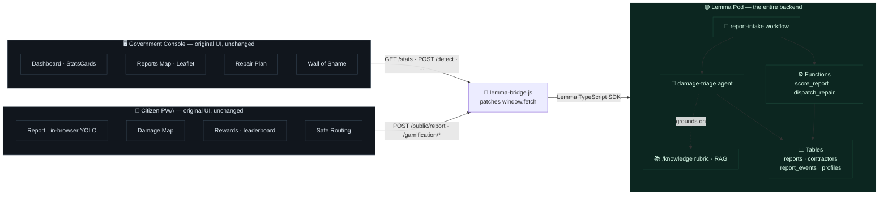
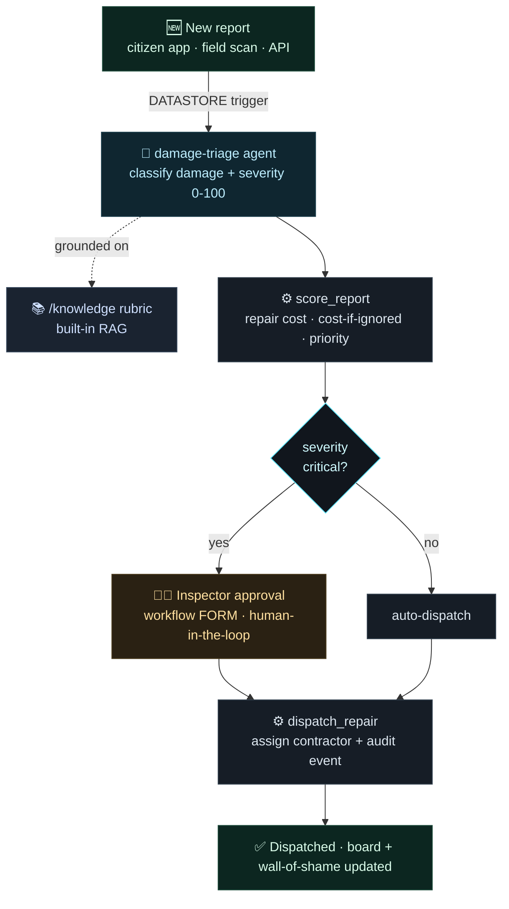
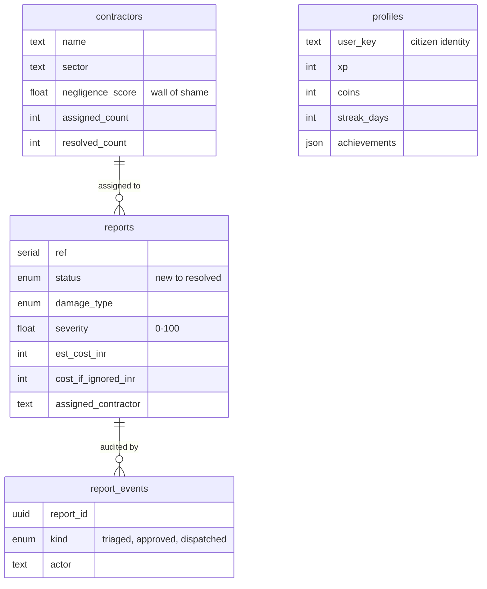
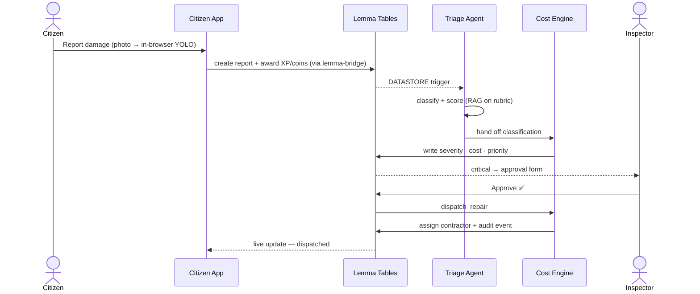

<h1 align="center">🛣️ CrackWatch <em>on</em> Lemma</h1>

<p align="center"><strong>An AI-native civic infrastructure platform — two React apps, and the <em>entire</em> backend rebuilt on the <a href="https://lemma.work">Lemma SDK</a>.</strong></p>

<p align="center">
  
  
  
  
  
</p>

---

Citizens report infrastructure damage — potholes, cracks, leaks. CrackWatch **triages each report with AI**, estimates the repair cost **and the cost of ignoring it**, routes critical cases to a **human inspector for approval**, **dispatches** the repair to an accountable contractor, and tracks every contractor's negligence on a public **wall of shame**. Citizens earn **XP, coins, streaks and badges** for reporting — civic duty as a game.

The original CrackWatch ran a polished React UI on a FastAPI + in-memory backend with a YOLO CV model. **This version deletes that entire backend and replaces it with one Lemma pod.** Both React UIs are reused *unchanged*; a thin `fetch` bridge points them at the pod.

**Two surfaces, one pod:**
- 📱 **Citizen app** — snap a photo, **on-device YOLOv8** triages it, earn XP/coins/badges, live damage map + pothole-avoiding routing → **[citizen-app.apps.lemma.work](https://citizen-app.apps.lemma.work)**
- 🖥️ **Government console** — live map, AI triage, repair cost vs. cost-if-ignored, human-approved dispatch, contractor wall of shame → **[govt-console.apps.lemma.work](https://govt-console.apps.lemma.work)**

> 💡 **The point of Lemma:** keep your frontend — replace the database **+** agent runtime **+** workflow engine **+** RAG **+** auth **+** event triggers **+** gamification ledger you'd otherwise stitch together with **one open-source pod** where humans and AI agents read and write the same state.

---

## 🏗️ Architecture

The frontends never changed. The backend became a pod.



Every component still calls `fetch('http://localhost:8000/...')`. Each app's `lemma-bridge.js` ([console](console/src/lib/lemma-bridge.js) · [citizen](citizen/src/lib/lemma-bridge.js)) intercepts those calls and serves them from the pod — so the UIs are **byte-for-byte unchanged**, but their data is live from Lemma. The citizen bridge additionally runs **real YOLOv8 in the browser** (onnxruntime-web) and drives the gamification engine on the `profiles` table.

---

## 🔁 The agentic loop



---

## 🟢 How Lemma is used

CrackWatch leans on **ten** Lemma primitives — not one bolted on superficially, but the whole platform doing real work:

| Lemma primitive | Where in CrackWatch | What it does |
|---|---|---|
| **📊 Tables** (shared, RLS-off) | [`pod/tables/`](pod/tables) — `reports`, `contractors`, `report_events`, `profiles` | Durable, typed civic state + the gamification ledger every agent and operator shares |
| **🤖 Agent** | [`pod/agents/damage-triage`](pod/agents/damage-triage) | LLM worker with a scoped instruction, an `output_schema`, and grants — classifies damage type + scores severity |
| **📚 Files + built-in RAG** | [`pod/files/knowledge`](pod/files/knowledge) + the severity/cost rubric | The agent **grounds** its scoring on a real engineering rubric — no external vector DB |
| **⚙️ Functions** (Python) | [`pod/functions/`](pod/functions) — `score_report`, `dispatch_repair` | Deterministic INR cost engine + coordinated multi-table writes via `Pod.from_env()` |
| **🔀 Workflow** | [`pod/workflows/report-intake`](pod/workflows/report-intake) | `AGENT → FUNCTION → DECISION → FORM → FUNCTION` — with a **human-approval step** |
| **⏰ Schedule / trigger** | [`pod/schedules/on-new-report`](pod/schedules/on-new-report) | `DATASTORE` event on `reports` INSERT — fires the workflow automatically |
| **🔐 Permissions** | `permissions.grants` on every agent + function | Zero-access-by-default; each workload is granted only the tables it touches |
| **🪟 Apps** | [`pod/apps/`](pod/apps) — `citizen-app`, `govt-console`, `command-center` | Both product UIs, deployed and served by the pod |
| **🧩 TypeScript SDK + auth** | [`console`](console/src/lib/lemma-bridge.js) + [`citizen`](citizen/src/lib/lemma-bridge.js) bridges | `records.list / create / update`, `datastore`, and delegated auth — back the existing React frontends |
| **🎮 Gamification ledger** | [`pod/tables/profiles`](pod/tables/profiles) + the citizen bridge | XP, coins, streaks, badges, leaderboard & AI-challenge — all persisted in the pod, no separate service |

### Why this is *meaningful* Lemma use, not a wrapper

- **🧠 Built-in RAG, zero infra.** The triage agent searches `/knowledge` for the severity & cost rubric and grounds every score on it — the pod *is* the vector store. No Pinecone, no embeddings pipeline.
- **🧑‍⚖️ Human-in-the-loop, natively.** Critical repairs pause at a workflow **FORM** assigned to an inspector and resume on their decision — the exact thing a bare chatbot can't do.
- **⚡ Reactive choreography.** A new `reports` row fires a `DATASTORE` schedule → the workflow runs itself. Operators don't push a button; the pod reacts.
- **🛡️ Delegated identity + least privilege.** Functions and the agent run as the invoking user with **name-based grants** — `score_report` can write `reports`, nothing else.
- **🧩 Bring-your-own-frontend, ×2.** The *entire* legacy REST surface of **two** apps (`/stats`, `/admin/reports/map`, `/public/report`, `/gamification/*`, `/detect`, `/repair-plan`, `/analytics/*`) is served from the pod by bridge files — neither React app changed a line.
- **👁️ Real CV on the edge.** YOLOv8 runs *in the browser* (onnxruntime-web); the pod stores the structured result. No GPU backend to host.

### What we did **not** have to build

> ~~PostgreSQL~~ &nbsp; ~~a vector DB~~ &nbsp; ~~an LLM agent runtime + tool loop~~ &nbsp; ~~a workflow/approval engine~~ &nbsp; ~~an auth layer~~ &nbsp; ~~webhook/event plumbing~~ &nbsp; ~~a gamification service~~

All of it is the **one pod** in [`pod/`](pod).

---

## 🧬 Data model



---

## 🎬 Report lifecycle



---

## 📁 Repository layout

```
crackwatch-lemma/
├── pod/                          # 🟢 the Lemma pod — the entire backend, as portable files
│   ├── pod.json  ·  DESIGN.md    #    metadata + the design note
│   ├── tables/                   #    reports · contractors · report_events · profiles
│   ├── agents/damage-triage/     #    the AI triage agent (instruction + grants)
│   ├── functions/                #    score_report (cost engine) · dispatch_repair
│   ├── workflows/report-intake/  #    triage → score → approval → dispatch
│   ├── schedules/on-new-report/  #    DATASTORE trigger
│   ├── files/knowledge/          #    RAG folder  (rubric uploaded by seed/)
│   ├── apps/                     #    citizen-app · govt-console · command-center
│   └── seed/                     #    sample data · rubric · demo profiles
├── console/                      # 🖥️ the government command-center frontend
│   └── src/lib/lemma-bridge.js   #    ⭐ the integration — fetch → Lemma pod
└── citizen/                      # 📱 the citizen PWA (Map · Report · Rewards · Route)
    └── src/lib/lemma-bridge.js   #    ⭐ citizen bridge — real YOLO + gamification
```

---

## 🚀 Run it

**Prerequisites** — the [Lemma CLI](https://lemma.work) (`uv tool install lemma-terminal`), Node 20+, and `lemma auth login`.

```bash
# 1 — deploy the pod
lemma orgs create "CrackWatch"
lemma pods create crackwatch --org <org-id>
lemma pods import ./pod --pod crackwatch
bash pod/seed/seed.sh                          # sample contractors + reports
bash pod/seed/seed_profiles.sh                 # demo citizen profiles (leaderboard)

# 2 — build & deploy the government console
cd console && npm install && npm run build      # vite-plugin-singlefile → dist/index.html
lemma apps deploy govt-console dist/index.html --pod crackwatch

# 3 — build & deploy the citizen app
cd ../citizen && npm install && npm run build
lemma apps deploy citizen-app dist/index.html --pod crackwatch
```

---

## 🛠️ Tech

**Lemma SDK** · React 19 · Vite 8 · Tailwind CSS v4 · YOLOv8 + onnxruntime-web · shadcn/ui · Leaflet · Recharts · Framer Motion · Python (pod functions)

<p align="center"><sub>Built for the <strong>Gappy AI Hackathon</strong> · June 2026 · by Saud Satopay</sub></p>
