<div align="center">

# 🛣️ CrackWatch *on* Lemma

### An AI-native civic infrastructure platform — two React apps, and the *entire* backend rebuilt on the [Lemma SDK](https://lemma.work).

*Citizens report road damage from their phone with on-device AI. A government command center triages it, prices the repair **and the cost of ignoring it**, and dispatches accountable contractors. There is no traditional backend — just one Lemma pod.*

<br/>

[](https://lemma.work)
[](#-system-architecture)


<br/>

[](https://citizen-app.apps.lemma.work)
&nbsp;
[](https://govt-console.apps.lemma.work)

</div>

---

<a id="toc"></a>
## 📑 Contents

| | | |
|---|---|---|
| 1. [The problem](#problem) | 5. [The agentic loop](#agentic-loop) | 9. [Gamification](#gamification) |
| 2. [The solution](#solution) | 6. [Computer vision](#cv) | 10. [Citizen journey](#journey) |
| 3. [System architecture](#architecture) | 7. [Severity & cost model](#severity) | 11. [Report lifecycle](#lifecycle) |
| 4. [How Lemma is used](#lemma) | 8. [Data model](#data-model) | 12. [Stack · layout · run · rationale · roadmap](#stack) |

> **TL;DR** — The original CrackWatch ran a FastAPI + in-memory backend. **This version deletes that backend and replaces it with one Lemma pod** — tables, an AI triage agent, RAG, Python functions, a human-approval workflow, event triggers, auth, and the gamification ledger. Two original React UIs are reused *unchanged*, pointed at the pod by a thin `fetch` bridge.

---

<a id="problem"></a>
## 🕳️ The problem

Cracked roads and potholes cause crashes, vehicle damage, and monsoon flooding — yet the reporting loop is broken on **both** ends. Citizens have no fast, satisfying way to report damage or watch it get fixed, so most hazards are never reported. Governments receive unstructured complaints with no triage, no cost forecasting, and no contractor accountability — so the most dangerous defects sit unrepaired while cheap fixes balloon into expensive ones.

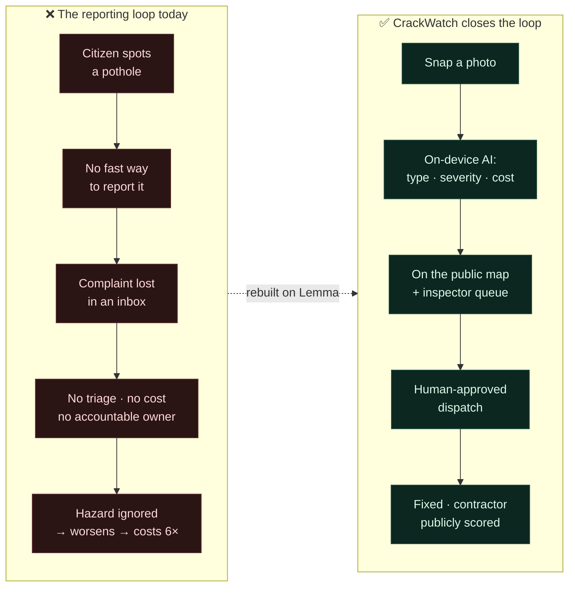

<div align="center"><sub><a href="#toc">▲ back to top</a></sub></div>

---

<a id="solution"></a>
## 💡 The solution

Two surfaces, **one shared pod** — humans and AI agents read and write the same state.

<table>
<tr>
<td width="50%" valign="top">

### 📱 Citizen app &nbsp;[↗](https://citizen-app.apps.lemma.work)
A mobile PWA. Snap a photo → **real YOLOv8 runs in the browser**, draws boxes, scores severity, and estimates repair cost. The report saves to the pod and the citizen earns **XP, coins, streaks & badges** on a civic leaderboard. A live map shows every report's status; *safe-route* navigation routes drivers **around** unrepaired hazards.

</td>
<td width="50%" valign="top">

### 🖥️ Government console &nbsp;[↗](https://govt-console.apps.lemma.work)
The command center. Every report on a live map, ranked by a prioritized repair plan with **repair cost vs. cost-if-ignored** — so delay has a price tag. Inspectors approve critical dispatches (human-in-the-loop). A contractor **Wall of Shame** ranks negligence publicly.

</td>
</tr>
</table>

> 💚 **Why Lemma:** keep your frontend — replace the database **+** agent runtime **+** workflow engine **+** RAG **+** auth **+** event triggers **+** gamification ledger you'd otherwise stitch together with **one open-source pod**.

<div align="center"><sub><a href="#toc">▲ back to top</a></sub></div>

---

<a id="architecture"></a>
## 🏗️ System architecture

The frontends never changed. The backend *became* a pod.

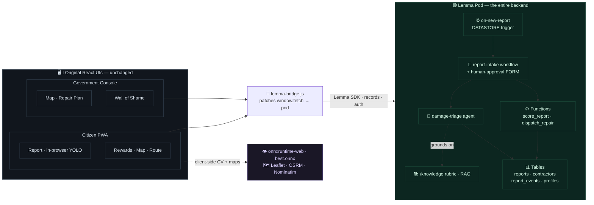

Every component still calls `fetch('http://localhost:8000/...')`. Each app's `lemma-bridge.js` ([console](console/src/lib/lemma-bridge.js) · [citizen](citizen/src/lib/lemma-bridge.js)) intercepts those calls and answers them from the pod — so the UIs are **byte-for-byte unchanged**, but their data is live from Lemma.

<div align="center"><sub><a href="#toc">▲ back to top</a></sub></div>

---

<a id="lemma"></a>
## 🟢 How Lemma is used

CrackWatch leans on **ten** Lemma primitives doing real work — visualised as the pod's anatomy:

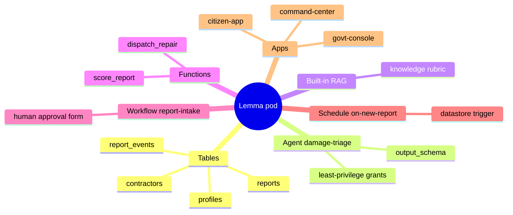

| # | Lemma primitive | Where in CrackWatch | What it does |
|---|---|---|---|
| 1 | **📊 Tables** (shared, RLS-off) | [`pod/tables/`](pod/tables) — `reports`, `contractors`, `report_events`, `profiles` | Durable, typed civic state + the gamification ledger every agent and operator shares |
| 2 | **🤖 Agent** | [`damage-triage`](pod/agents/damage-triage) | LLM worker with a scoped instruction, an `output_schema`, and grants — classifies damage + scores severity 0–100 |
| 3 | **📚 Files + built-in RAG** | [`/knowledge`](pod/files/knowledge) rubric | The agent **grounds** every score on a real engineering rubric — no external vector DB |
| 4 | **⚙️ Functions** (Python) | [`score_report`, `dispatch_repair`](pod/functions) | Deterministic INR cost engine + coordinated multi-table writes via `Pod.from_env()` |
| 5 | **🔀 Workflow** | [`report-intake`](pod/workflows/report-intake) | `AGENT → FUNCTION → DECISION → FORM → FUNCTION`, with a **human-approval** step |
| 6 | **⏰ Schedule / trigger** | [`on-new-report`](pod/schedules/on-new-report) | A `DATASTORE` INSERT event on `reports` fires the workflow |
| 7 | **🔐 Permissions** | `grants` on every agent + function | Least-privilege: `score_report` writes `reports`, nothing else |
| 8 | **🪟 Apps** | [`pod/apps/`](pod/apps) — `citizen-app`, `govt-console`, `command-center` | Both product UIs, deployed and served *by the pod* |
| 9 | **🧩 SDK + auth** | [console](console/src/lib/lemma-bridge.js) + [citizen](citizen/src/lib/lemma-bridge.js) bridges | `records.list/create/update` + delegated auth backing the unchanged React UIs |
| 10 | **🎮 Gamification ledger** | [`profiles`](pod/tables/profiles) + the citizen bridge | XP / coins / streaks / badges / leaderboard — persisted in the pod, no separate service |

<details>
<summary><b>Why this is meaningful Lemma use, not a wrapper</b> — click to expand</summary>

<br/>

- **🧠 Built-in RAG, zero infra.** The triage agent searches `/knowledge` for the severity & cost rubric and grounds every score on it — the pod *is* the vector store. No Pinecone, no embeddings pipeline.
- **🧑‍⚖️ Human-in-the-loop, natively.** Critical repairs pause at a workflow **FORM** assigned to an inspector and resume on their decision — the exact thing a bare chatbot can't do.
- **⚡ Reactive choreography.** A new `reports` row fires a `DATASTORE` schedule → the workflow runs itself. Operators don't push a button; the pod reacts.
- **🛡️ Delegated identity + least privilege.** Functions and the agent run as the invoking user with **name-based grants**.
- **🧩 Bring-your-own-frontend, ×2.** The entire legacy REST surface of **two** apps is served from the pod by bridge files — neither React app changed a line.
- **👁️ Real CV on the edge.** YOLOv8 runs *in the browser*; the pod stores the structured result. No GPU backend to host.

> **What we did *not* build:** ~~PostgreSQL~~ · ~~a vector DB~~ · ~~an LLM agent runtime + tool loop~~ · ~~a workflow/approval engine~~ · ~~an auth layer~~ · ~~webhook/event plumbing~~ · ~~a gamification service~~ — all of it is the **one pod** in [`pod/`](pod).

</details>

<div align="center"><sub><a href="#toc">▲ back to top</a></sub></div>

---

<a id="agentic-loop"></a>
## 🔁 The agentic loop

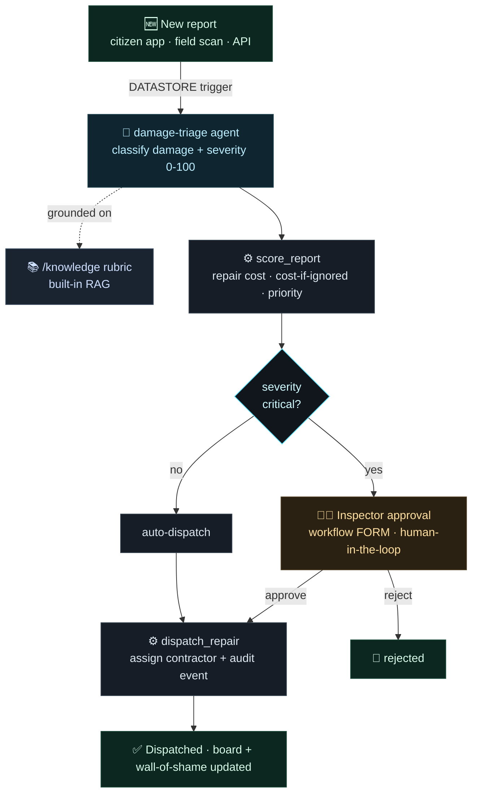

And the report's full state machine across humans, AI, and contractors:

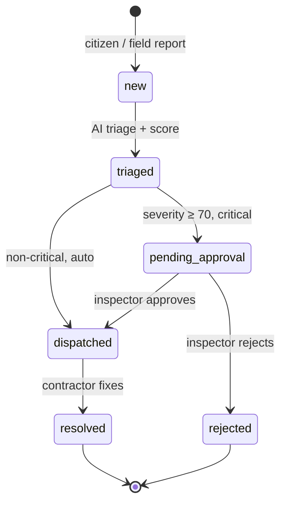

<div align="center"><sub><a href="#toc">▲ back to top</a></sub></div>

---

<a id="cv"></a>
## 👁️ Computer vision — YOLOv8, in the browser

The original CrackWatch ran YOLO on a Python server. Here it runs **client-side** via `onnxruntime-web` (WASM) — the model (`best.onnx`) streams from the repo, inference happens on-device, and only the structured result touches the pod.

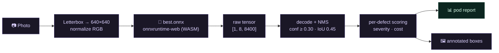

The model detects **4 road-damage classes**, each carrying a *type weight* that feeds the severity model:

| Class | `class_id` | Type weight | Why |
|---|:---:|:---:|---|
| 🕳️ Pothole | 3 | **1.00** | Immediate crash / tyre hazard |
| 🐊 Alligator crack | 2 | **1.00** | Signals sub-base failure |
| ↔️ Transverse crack | 1 | 0.75 | Thermal / structural, spreads |
| ↕️ Longitudinal crack | 0 | 0.70 | Often early-stage |

<div align="center"><sub><a href="#toc">▲ back to top</a></sub></div>

---

<a id="severity"></a>
## 🧮 The severity & cost model

This is the "research" core — a transparent, auditable pipeline (not a black box) that turns a detection into a **0–100 severity score**, a repair cost, and the cost of ignoring it. Mirrored from the pod's `/knowledge` rubric so the agent and the client agree.

#### Severity = weighted blend of four factors

```
severity = 100 × ( 0.30·area + 0.25·confidence + 0.20·density + 0.25·typeWeight )
```

| Factor | Weight | Source |
|---|:---:|---|
| **Area ratio** (defect px ÷ frame, capped) | `0.30` | bounding-box geometry |
| **Detection confidence** | `0.25` | YOLO class score |
| **Defect density** (how many in frame) | `0.20` | detection count |
| **Damage-type weight** | `0.25` | class lookup (table above) |

→ banded into **🟢 minor** (`<40`), **🟠 warning** (`40–69`), **🔴 critical** (`≥70`).

#### Cost engine

```
repair_cost      = mean(cost_band) × (1 + 2·area%)
cost_if_ignored  = repair_cost × { minor ×3 · warning ×4 · critical ×6 }
```

Cost bands are real, per damage type and severity (INR):

| Damage type | 🟢 Minor | 🟠 Warning | 🔴 Critical |
|---|---|---|---|
| Pothole | ₹1k–3k | ₹3k–10k | ₹10k–30k |
| Alligator crack | ₹3k–10k | ₹10k–40k | ₹40k–1.5L |
| Longitudinal crack | ₹0.5k–2k | ₹2k–8k | ₹8k–25k |
| Transverse crack | ₹0.8k–3k | ₹3k–12k | ₹12k–35k |
| Pipe damage | ₹5k–15k | ₹15k–50k | ₹50k–2L |
| Building crack | ₹2k–8k | ₹8k–30k | ₹30k–1L |

#### The triage matrix

Every defect lands somewhere on the **severity × cost** plane — which drives the repair plan's ordering:

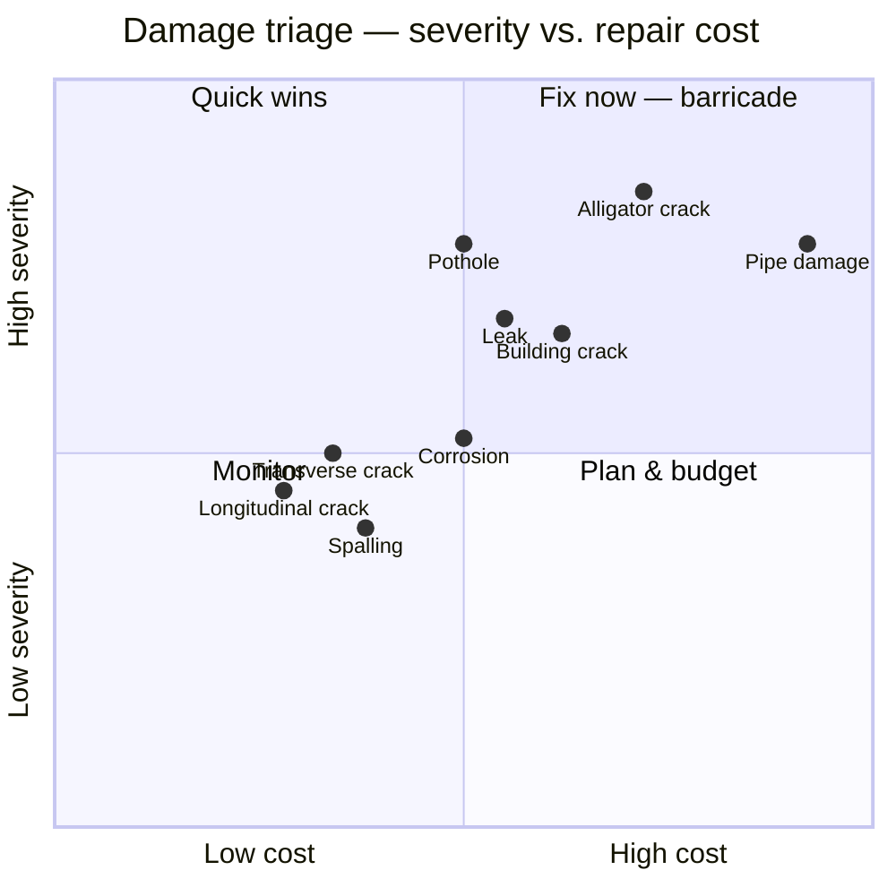

> 💡 The killer government feature isn't the repair cost — it's **`cost_if_ignored`**. A ₹10k pothole left to fail becomes a ₹60k reconstruction. CrackWatch puts that number on the dashboard.

<div align="center"><sub><a href="#toc">▲ back to top</a></sub></div>

---

<a id="data-model"></a>
## 🧬 Data model

Four Lemma tables, shared by citizens, inspectors, agents, and scheduled jobs:

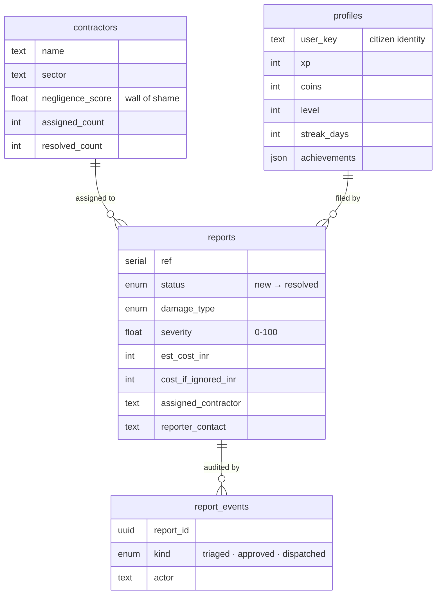

<div align="center"><sub><a href="#toc">▲ back to top</a></sub></div>

---

<a id="gamification"></a>
## 🎮 Gamification — civic duty as a game

Reporting damage earns **XP, civic coins, streaks, and badges**, all persisted in the `profiles` table. The leaderboard is a single `records.list` query — no separate service.

#### Leveling curve

```
level = ⌊ √(xp / 100) ⌋ + 1
```

| Level | XP needed | | Level | XP needed |
|:---:|:---:|---|:---:|:---:|
| 2 | 100 | | 5 | 1,600 |
| 3 | 400 | | 7 | 3,600 |
| 4 | 900 | | 10 | 8,100 |

#### Where XP comes from (a typical active week)

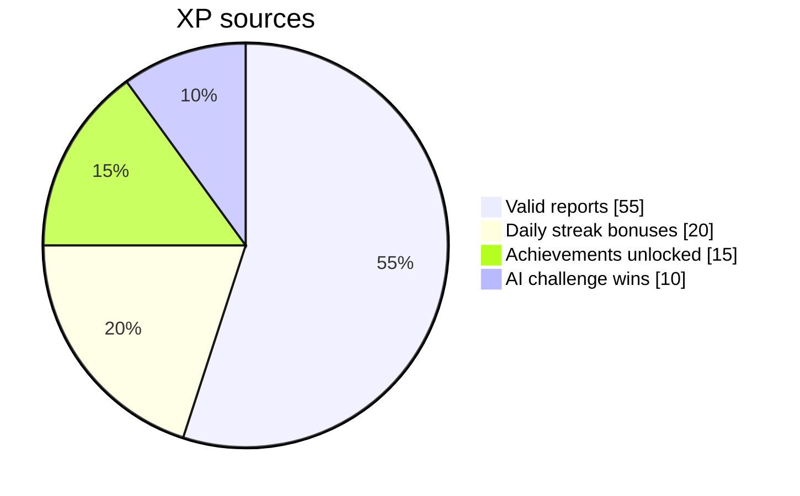

#### Point values & a sample of the 13 badges

| Action | Points | | Badge | Unlock |
|---|:---:|---|---|---|
| Critical defect | +15 | | 🕵️ First Report | 1 report |
| Pothole / warning | +10 | | 🔥 Road Warrior | 10 reports |
| Crack | +7 | | 🛠️ Civic Hero | 25 reports |
| Minor | +5 | | 🚨 Critical Finder | report a critical |
| Streak (per day) | +5 | | 🔍 Inspector | 3 sectors |
| False report | −5 | | 🔥🔥🔥 Legend | 30-day streak |

*(XP = points × 5; coins = points ÷ 2; first profile starts with a 50-coin bonus.)*

<div align="center"><sub><a href="#toc">▲ back to top</a></sub></div>

---

<a id="journey"></a>
## 🧭 The citizen journey

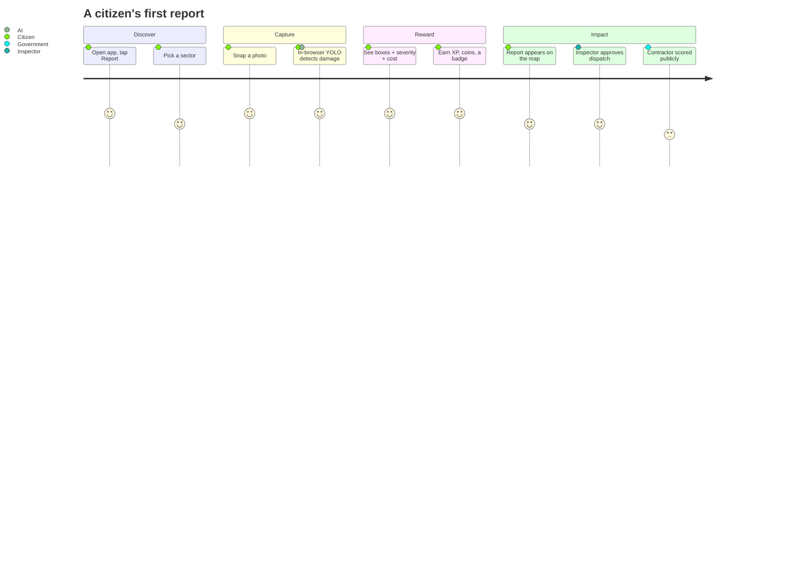

<div align="center"><sub><a href="#toc">▲ back to top</a></sub></div>

---

<a id="lifecycle"></a>
## 🎬 Report lifecycle — end to end

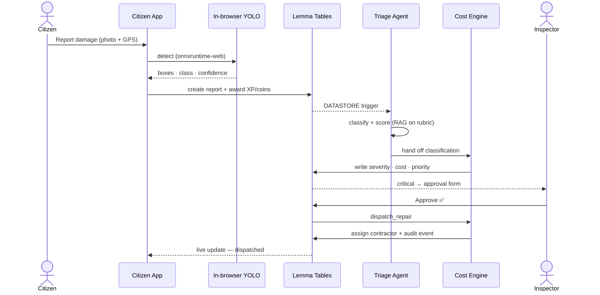

<div align="center"><sub><a href="#toc">▲ back to top</a></sub></div>

---

<a id="stack"></a>
## 🛠️ Tech stack

| Layer | Tech |
|---|---|
| **Backend** | 🟢 **Lemma pod** — tables · agent · RAG · functions · workflow · schedule · auth |
| **Frontend** | React 19 · Vite 8 (single-file build) · Tailwind v4 · Framer Motion |
| **Computer vision** | YOLOv8 → ONNX · onnxruntime-web (WASM), in-browser |
| **Maps / routing** | Leaflet · CARTO tiles · OSRM (routing) · OSM Nominatim (geocoding) |
| **Functions** | Python (`Pod.from_env()`) |

<a id="layout"></a>
## 📁 Repository layout

```
crackwatch-lemma/
├── pod/                          # 🟢 the Lemma pod — the entire backend, as portable files
│   ├── pod.json  ·  DESIGN.md    #    metadata + the design note
│   ├── tables/                   #    reports · contractors · report_events · profiles
│   ├── agents/damage-triage/     #    AI triage agent (instruction + output_schema + grants)
│   ├── functions/                #    score_report (cost engine) · dispatch_repair
│   ├── workflows/report-intake/  #    triage → score → human approval → dispatch
│   ├── schedules/on-new-report/  #    DATASTORE trigger
│   ├── files/knowledge/          #    RAG folder  (severity + cost rubric)
│   ├── apps/                     #    citizen-app · govt-console · command-center
│   └── seed/                     #    sample data · rubric · demo leaderboard profiles
├── console/                      # 🖥️ government command-center frontend
│   └── src/lib/lemma-bridge.js   #    ⭐ fetch → Lemma pod
└── citizen/                      # 📱 citizen PWA (Map · Report · Rewards · Stats · Route)
    └── src/lib/lemma-bridge.js   #    ⭐ citizen bridge — real YOLO + gamification
```

<a id="run"></a>
## 🚀 Run it

> **Prereqs** — the [Lemma CLI](https://lemma.work) (`uv tool install lemma-terminal`), Node 20+, `lemma auth login`.

```bash
# 1 — deploy the pod (the entire backend)
lemma orgs create "CrackWatch"
lemma pods create crackwatch --org <org-id>
lemma pods import ./pod --pod crackwatch
bash pod/seed/seed.sh                          # sample contractors + reports
bash pod/seed/seed_profiles.sh                 # demo leaderboard profiles

# 2 — build & deploy the government console
cd console && npm install && npm run build      # vite-plugin-singlefile → dist/index.html
lemma apps deploy govt-console dist/index.html --pod crackwatch

# 3 — build & deploy the citizen app
cd ../citizen && npm install && npm run build
lemma apps deploy citizen-app dist/index.html --pod crackwatch
```

<a id="decisions"></a>
## 🧠 Engineering rationale

<details>
<summary><b>Why run YOLO in the browser instead of a pod function?</b></summary>

<br/>Client-side inference means **zero GPU backend to host**, instant feedback (no upload round-trip), and the pod only ever stores the small structured result — not raw images. The pod stays cheap and fast; the phone does the heavy lifting.
</details>

<details>
<summary><b>Why is the <code>profiles</code> table RLS-off / POD-visible?</b></summary>

<br/>The leaderboard needs to read across *all* players, and a citizen's identity here is a chosen display name rather than a Lemma account. RLS-off / POD visibility matches the other shared civic tables and keeps the leaderboard a single query. (Per-user private rows would make a multiplayer leaderboard impossible.)
</details>

<details>
<summary><b>Why the <code>fetch</code>-bridge pattern?</b></summary>

<br/>It let us migrate two production React apps onto Lemma **without touching a single component**. The bridge patches <code>window.fetch</code>, maps each legacy REST route to <code>records.list/create/update</code>, and returns a normal <code>Response</code>. The UI can't tell the difference — but there's no server behind it, just the pod.
</details>

<details>
<summary><b>Why mirror the rubric on both the client and the agent?</b></summary>

<br/>The client scorer gives citizens instant triage; the pod's <code>damage-triage</code> agent — grounded on the same <code>/knowledge</code> rubric via RAG — provides the authoritative, auditable score for the government workflow. Same rules, two enforcement points.
</details>

<a id="roadmap"></a>
## 🛣️ Build & roadmap

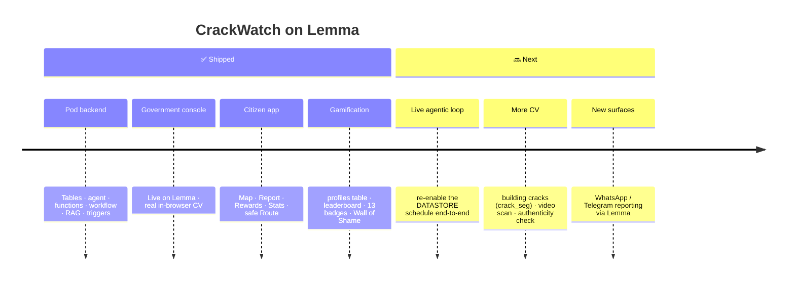

---

<div align="center">

### 📱 [citizen-app.apps.lemma.work](https://citizen-app.apps.lemma.work) &nbsp;·&nbsp; 🖥️ [govt-console.apps.lemma.work](https://govt-console.apps.lemma.work)

**Two apps. One Lemma pod. Zero glue.**

<sub>Built for the <strong>Gappy AI Hackathon</strong> · June 2026 · by Saud Satopay, Sahil Addagatla & Aryan Walunj</sub>

<sub><a href="#toc">▲ back to top</a></sub>

</div>
